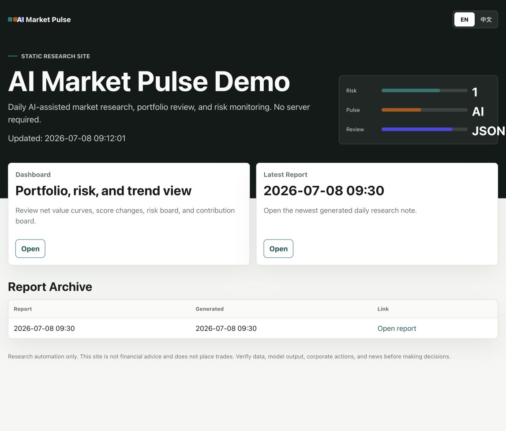
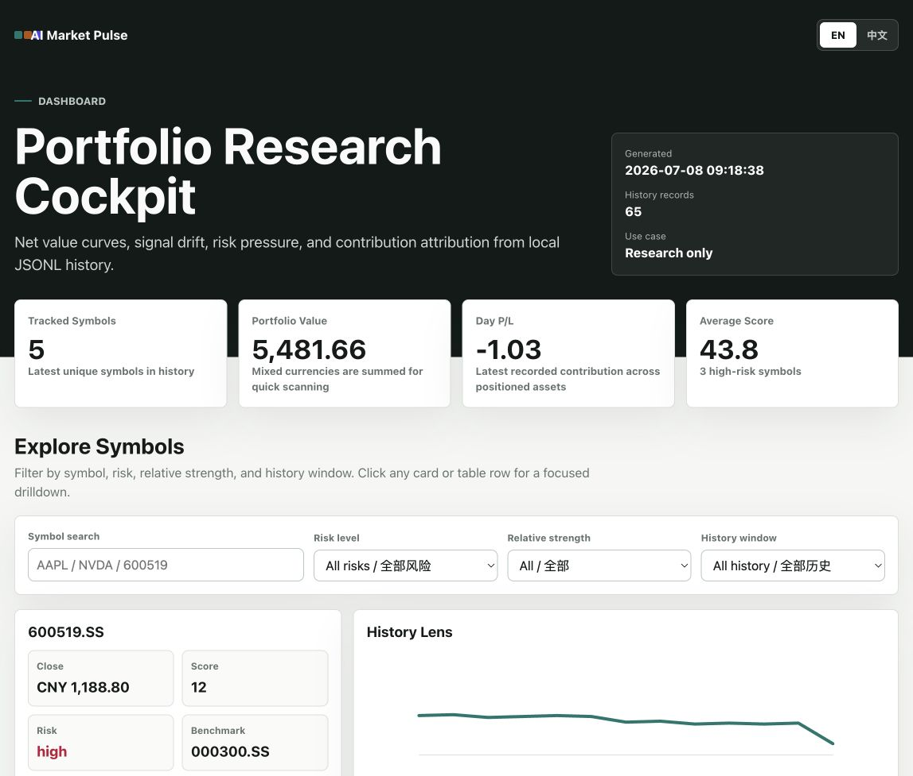
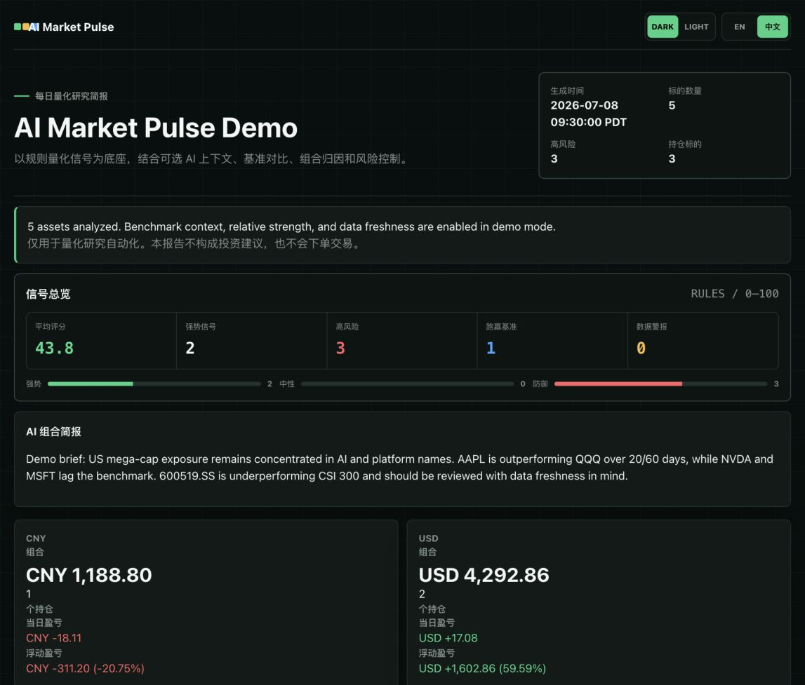

<div align="center">


[](README.md)
[](README.en.md)

[](https://github.com/SilentFleetKK/ai-market-pulse/actions/workflows/ci.yml)
[](LICENSE)
[](pyproject.toml)
[](#风险提示)

</div>

---

### 目录

[这是什么](#这是什么) · [60 秒体验完整产品](#60-秒体验完整产品) · [产品界面](#产品界面) · [核心能力](#核心能力) · [快速开始](#快速开始) · [数据源](#数据源) · [启用 AI 总结](#启用-ai-总结) · [发布](#发布) · [风险提示](#风险提示)

---

## 这是什么

> **AI Market Pulse 是一个 AI + 量化交易研究驾驶舱，用于自选股筛选、交易信号复盘、基准对比、组合归因、风险控制、自动报告和静态发布。**

它不只是一个定时脚本，也不是只服务一类人：

| 量化研究者 | 普通持仓者 |
|---|---|
| 一个轻量的量化研究驾驶舱——自选股筛选、规则驱动的信号评分、基准相对强弱、组合归因、风险发现，全部渲染成 Markdown/HTML/JSON 日报、Web Dashboard 和可发布的静态研究站点。支持交易信号复盘、组合风险检查、盘前/盘后研究这类量化工作流，但不连接券商、不自动下单、不承诺收益——它是决策辅助，不是下单通道。 | 打开本地控制台，输入代码，点一下运行——不用写 YAML，不用改配置文件，不用写代码。你拿到的是同一份日报、同一个风险视图、同一个 Dashboard，只是不需要先搞懂背后那套量化逻辑才能用起来。 |

本项目是原创实现，灵感来自"AI 股票每日分析工具"的真实需求，不是 fork，也不是复制其他仓库。



| Dashboard | 每日研究报告 |
|---|---|
|  |  |

## 60 秒体验完整产品

运行离线 demo。它使用确定性的示例数据，不需要行情 API、新闻 API 或 LLM Key。

```bash
pip install -e ".[dev]"
market-pulse demo --output demo
```

然后打开：

- `demo/site/index.html`
- `demo/reports/dashboard.html`
- `demo/reports/market-pulse-20260708-0930.html`

## 产品界面

| 界面 | 展示内容 | 输出 |
|---|---|---|
| 每日研究报告 | 市场简报、AI 组合简报、焦点看板、观察列表、单股卡片、新闻 | `reports/market-pulse-*.html` |
| Web Dashboard | 组合净值、评分变化、风险榜、收益贡献榜 | `reports/dashboard.html` |
| 静态研究站点 | Dashboard 入口、最新报告、历史归档、导航入口 | `site/index.html` |
| JSONL 历史 | 用于趋势渲染的本地持久化快照 | `data/history.jsonl` |

## 核心能力

- 支持股票、ETF、加密资产，以及 Yahoo Finance 兼容代码。
- 本地可视化控制台：输入股票代码、生成报告、刷新 Dashboard、打开静态站点。
- 支持 `market-pulse run --symbols` 一条命令查询自定义股票池。
- 量化交易研究流程：股票池筛选、信号复盘、基准对比、组合归因、风险控制。
- 规则优先的 0-100 信号评分，带风险标签和可读原因。
- 技术指标：均线、RSI、MACD、布林位置、ATR、回撤、量比、5/20/60 日收益。
- 组合模式：数量、成本、市值、仓位占比、当日盈亏、浮动盈亏。
- 基准对比：SPY、QQQ、沪深300、恒生指数，以及可配置的市场基准。
- 单股相对强弱：展示 20/60 日收益相对基准的跑赢或跑输。
- Focus Board：重点关注、风险发现、贡献排序、每日检查清单。
- 交互式 Dashboard：代码搜索、风险筛选、相对强弱筛选、历史窗口、单股详情钻取。
- 数据新鲜度：最新交易日、数据源、历史行数、滞后或缺失风险提示。
- 多数据源：默认 yfinance，可选 AkShare、Baostock、Tushare 增强 A 股覆盖。
- 可选 OpenAI 兼容模型：单股总结、组合总结、prompt 模板、本地缓存。
- 推送通知：Telegram、Slack、Discord、飞书、企业微信、通用 webhook、邮件；`market-pulse init --telegram-token ... --telegram-chat-id ...` 或 `--feishu-webhook ...` 一条命令即可配置 Telegram/飞书，详见 [docs/NOTIFICATIONS.md](docs/NOTIFICATIONS.md)。
- GitHub Actions 与 GitHub Pages：无需服务器也能每日发布。
- 生成的 HTML 页面支持 EN / 中文切换。

## 快速开始

```bash
git clone https://github.com/SilentFleetKK/ai-market-pulse.git
cd ai-market-pulse
python -m venv .venv
source .venv/bin/activate
pip install -e ".[dev]"
market-pulse serve
```

打开 `http://127.0.0.1:8766`，输入你想看的股票代码，点击 **开始分析**。

如果偏好命令行，也可以直接运行：

```bash
market-pulse run --symbols "AAPL,MSFT,NVDA,TSLA,600519" --output reports --no-notify
```

打开 `reports/` 里的 HTML 文件即可查看报告。把示例代码换成你自己的股票池即可，支持 Yahoo Finance 兼容代码、加密资产、港股代码和 A 股代码。纯 6 位 A 股代码会自动补后缀，例如 `600519` 会变成 `600519.SS`。

为自己的股票池生成完整 Dashboard 和静态站点：

```bash
market-pulse run --symbols "AAPL,MSFT,NVDA,TSLA,600519" --output reports --history data/history.jsonl --no-notify
market-pulse dashboard --history data/history.jsonl --output reports/dashboard.html
market-pulse site --reports reports --output site --title "My Market Pulse"
```

如果想保存一个可复用股票池文件：

```bash
market-pulse init --symbols "AAPL,MSFT,NVDA,TSLA,600519" --path watchlist.yaml
market-pulse run --config watchlist.yaml --output reports --history data/history.jsonl --no-notify
```

## 配置模板

如果想从预设行业/市场模板开始，也可以不用 `--symbols`。

```bash
market-pulse init --list-templates
market-pulse init --template us-tech --path watchlist.yaml
market-pulse init --template cn-stock --path watchlist.yaml
market-pulse init --template crypto --path watchlist.yaml
```

## 导入持仓

```bash
market-pulse import-portfolio --input examples/portfolio.csv --output watchlist.yaml --template default --force
```

支持 `.csv`、`.tsv`、`.xlsx`。XLSX 需要安装：

```bash
pip install -e ".[excel]"
```

可识别字段包括 `symbol`、`ticker`、`code`、`name`、`market`、`currency`、`quantity`、`qty`、`shares`、`cost_basis`、`avg_cost`、`tags`、`note`，也支持 `股票代码`、`股票名称`、`持仓`、`成本价`、`标签`、`备注`。

## Dashboard 与静态站点

```bash
market-pulse run --config watchlist.yaml --output reports --history data/history.jsonl --no-notify
market-pulse dashboard --history data/history.jsonl --output reports/dashboard.html
market-pulse site --reports reports --output site --title "AI Market Pulse"
```

打开 `site/index.html`。生成的日报、Dashboard 和站点首页都支持 EN / 中文切换。

## 数据源

```yaml
data:
  providers: ["akshare", "yfinance"]
```

## 基准与数据新鲜度

```yaml
benchmarks:
  enabled: true
  symbols: ["SPY", "QQQ", "000300.SS", "^HSI"]
  default_by_market:
    US: "SPY"
    CN: "000300.SS"
    HK: "^HSI"
  compare:
    AAPL: "QQQ"
    NVDA: "QQQ"
  stale_after_days: 4
```

报告会展示基准概览、单股相对强弱、最新交易日、数据源，以及数据滞后或缺失风险。

可选 A 股增强数据源：

```bash
pip install -e ".[cn]"
pip install -e ".[tushare]"
export TUSHARE_TOKEN="..."
```

数据源按顺序尝试；某个数据源缺失或不支持该标的时，会自动尝试下一个。

## 启用 AI 总结

```yaml
llm:
  enabled: true
  base_url: "${OPENAI_BASE_URL:-https://api.openai.com/v1}"
  api_key_env: "OPENAI_API_KEY"
  model: "${OPENAI_MODEL:-}"
  temperature: 0.2
  prompts_dir: "prompts"
  cache_enabled: true
  cache_dir: "data/ai-cache"
```

```bash
export OPENAI_API_KEY="..."
export OPENAI_MODEL="your-model-name"
market-pulse run --config watchlist.yaml --output reports
```

常用开关：

```bash
market-pulse run --config watchlist.yaml --output reports --no-ai
market-pulse run --config watchlist.yaml --output reports --ai-only
market-pulse doctor --config watchlist.yaml
```

## Docker

```bash
docker compose up --build
```

这会生成 `reports/`、`data/history.jsonl` 和 `site/`。

## 发布

项目内置：

- `.github/workflows/ci.yml`
- `.github/workflows/daily-report.yml`
- `.github/workflows/pages.yml`
- [docs/PUBLISHING.md](docs/PUBLISHING.md)

推到 GitHub 后，可以配置 `OPENAI_API_KEY`、`OPENAI_MODEL`、`OPENAI_BASE_URL`、`TELEGRAM_BOT_TOKEN`、`TELEGRAM_CHAT_ID`、`TUSHARE_TOKEN` 等 secrets。

## 路线图

查看 [CHANGELOG.md](CHANGELOG.md) 和 [ROADMAP.md](ROADMAP.md)。

## 风险提示

不管你是把它当量化筛选工具用，还是当每日自选股报告用，本软件都仅用于研究自动化：不提供投资建议，不承诺收益，不连接券商，也不会自动交易或下单。做任何决策前，请自行核验行情、新闻、模型输出、公司行动和风险。
